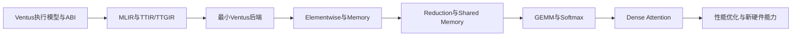

# Triton-for-Ventus 学习与实施路线

> 当前 `ventus-env` 设施、版本和能力边界以
> `2026-08-25-ventus-env-facility-snapshot.md` 为准。本文中的后端能力均指
> 首期固定目标 Profile，不代表所有 Ventus 参数化配置。
> V1 的范围、里程碑和验收条件以
> [Triton-for-Ventus V1 范围规范](2026-08-28-triton-for-ventus-v1-scope.md)
> 为权威来源；本文中超出该规范的算子学习内容均是 V1 之后的路线，不是 V1 承诺。

## 1. 目标

本文规划一条从 Ventus 基础知识、V1 Triton backend 到后续主流算子和标准 Dense
Attention 的学习、开发与验证路线。V1 只包含 basic FP32 Triton backend、明确
定义的 blocked FP32 FMA reference/fallback，以及固定 RTL-profile FP32 MMA vertical
slice；不包含 general `tl.dot`。

最终目标是建立以下端到端编译链：

```text
Triton Python DSL
  -> TTIR
  -> TTGIR
  -> conceptual TritonGPUToVentus / producer-specific adapter
  -> VentusLLVM16Compatibility
  -> kernel.ventus.ll + pinned Ventus LLVM tool invocation
  -> Ventus LLVM Backend
  -> Ventus ELF
  -> Spike / CycleSim / RTL Simulation / GVM
```

物理硬件 Driver Backend 是后续能力，不属于当前 `ventus-env` 可执行基线。
检查到的 Ventus LLVM 是 LLVM 16 fork，而当前 Triton 使用更新的 LLVM/MLIR；在
revision 有意对齐前，V1 不假设可直接链接 shared compiled C++ MLIR library，而以
producer-specific adapter 和 textual LLVM IR/tool boundary 为 concrete integration。
其中 `VentusLLVM16Compatibility` 是 Triton Ventus Backend 拥有的 M1 producer-side
component：输入是 serialization 前的 producer-local MLIR LLVM Dialect/native IR，输出
是 `kernel.ventus.ll`。它通过约束 translation output 建立 tested LLVM 16 subset，不做
任意版本转换，不允许字符串替换。

长期学习路线的目标算子范围包括：

- Elementwise 和 Broadcast。
- Masked Load/Store 和常见内存访问。
- Reduction。
- Shared Memory 和 Work-group Barrier。
- RMSNorm、LayerNorm 和 Softmax。
- GEMV、GEMM 和 Batched GEMM。
- 标准 Dense Attention 和 Causal Dense Attention。

V1 固定约束为：

- 正确性优先，性能优化后置。
- 首先支持 FP32。
- target 为 `riscv32`/`ventus-gpgpu`，RV32 pointers，scalar types 为 `i1/i32/f32`。
- Artifact Profile 要求 Warp Size 为 32，与默认 RTL 配置一致。
- 一个 Triton CTA 对应一个 Ventus Work-group。
- general path local size 只允许 `[32,1,1]` 或 `[64,1,1]`；MMA 只允许
  `[32,1,1]`。默认 RTL 的 8 warp/256 work-item 只是 validation ceiling。
- Layout 只覆盖 `BlockedEncodingAttr`、`SliceEncodingAttr`、`SharedEncodingAttr`，
  以及 M3 freeze 后固定 MMA 所需的 proposed `VentusMmaEncodingAttr`/
  `VentusDotOperandEncodingAttr`。
- static AS3 shared memory 和 full work-group barrier；不支持 dynamic local arguments。
- ordinary blocked FP32 FMA 的 mandatory canonical accepted case 是 static blocked
  `M=N=K=32`，只作为 reference/fallback，不是一般 matrix path，也不代表 general
  `tl.dot`；额外 static blocked pattern 只有具备显式 lowering 和 correctness tests
  才进入 accepted set。
- V1 同时包含 M3/M4 gated 的固定 FP32 MMA vertical slice，不是通用 Tensor Core 路径。

V1 明确排除：

- FP16、BF16、FP8 和低比特量化。
- general/low-precision MMA、arbitrary MMA shapes 和 general `tl.dot`。
- Shuffle、Ballot 和未经验证的 subgroup collectives。
- Async Copy、Warp Specialization、CTA Cluster 和所有 Atomics。
- 任意 Gather/Scatter。
- Decode Attention 和 Paged KV Cache。
- 物理 hardware driver。

## 2. 总体方法

采用“上下夹逼”的学习和开发方法，而不是只从 Triton 或 LLVM 单向推进。

```text
底层参考路径：
OpenCL C -> Ventus Clang -> LLVM IR -> ELF -> Spike

上层算子路径：
Triton DSL -> TTIR -> TTGIR

中间汇合：
TTGIR -> TritonGPUToVentus -> Ventus LLVM IR
```

每增加一个算子，同时观察和保存：

1. OpenCL Reference Kernel。
2. Triton Kernel。
3. TTIR。
4. TTGIR 和 Layout。
5. Ventus LLVM IR。
6. Ventus Assembly。
7. ELF Resource Metadata。
8. Spike/CycleSim 结果。

这样可以将问题定位到：

```text
Triton前端语义
TTGIR Layout
目标Lowering
Ventus LLVM
Kernel ABI
Runtime
硬件或模拟器
```

## 3. 学习地图



V1 正式里程碑：

```text
M1：basic backend + Ventus LLVM 16 compatibility + ABI/manifest/resource validation + Spike
M2：static AS3 shared memory + full work-group barrier + reduction + fixed 32x32x32 blocked FP32 FMA
M3：建立包含 source pin/hash、effective parameters、generated RTL、testbench 的 verified generation record，再做 mandatory RTL/Spike contract freeze；CycleSim capability-gated
M4：仅在 M3 manifest 全字段冻结后，将匹配 VentusMmaProfileA 的 Triton tl.dot lowering 到 vftta.vv
```

RTL compatibility review 不阻塞 basic backend 主线，但为 M1/M2 增加明确边界：AS4 不是
独立 memory guarantee，AS5/PDS 只是 spill/resource convention，divergent control flow
必须 bounded/validated，resource units、ELF identity、simulator physical-address convention
和 deterministic completion/timeout/cache flush 都是待实现 contract。

M1 编译闭环有三个独立 gate：internal `LLVM16CompatibilityChecker`、absolute Ventus
LLVM 16 `opt` parse/verify、absolute Ventus LLVM 16 `llc` target codegen to object；
`opt -verify` 单独不足。Task 12 的 ELF/Spike execution 是第四个 gate。manifest 必须保存
`kernel.ventus.ll` content hash、三个 gate 的命令/输出/诊断和 object hash。
Gate 3 object 之后还必须由 producer-local `third_party/ventus/backend/compiler.py`
使用 absolute `VENTUS_LLD`、Task 1 pinned linker script、crt0、libclc/workitem inputs 和
kernel entry/init contract 链接成 ELF，再进入 Gate 4 Spike。具体安装文件名由 Task 1 和
ABI golden 核验，不在路线图中猜测。

RMSNorm、Softmax、完整 GEMM/Batched GEMM 和 Dense Attention 是 V1 之后的算子
扩展路线，除非后续权威 scope 明确纳入。

## 4. 阶段一：Ventus 执行模型与 LLVM ABI

### 4.1 学习目标

首先理解 Ventus 是 CUDA-like SIMT GPGPU，而不是普通 RVV CPU Target。

必须掌握：

- Grid、Block/CTA、Warp、Thread/Lane。
- 默认 Profile 的 32-thread Warp，以及 Artifact 所需 Warp Size 校验。
- SGPR 和 VGPR 的职责、`REGEXT/REGEXTI` 扩展寄存器索引和资源计数。
- `CSR_TID`、`vid.v` 和 Work-item ID。
- Global、Shared/Local 和 Private Memory。
- Work-group Barrier。
- 当前 LLVM 已有 work-group/scoped barrier intrinsic；Subgroup Barrier
  语义尚未稳定验证。
- Active Mask 和分支发散。
- `VBEQ/VBNE/VBLT`、`SETRPC`、`JOIN` 和 SIMT Stack。
- `ventus_kernel` Calling Convention。
- Kernel Argument Buffer。
- `.ventus.resource.<kernel>` 中的 VGPR、SGPR、LDS 和 PDS。
- Kernel 结束语义。当前 LLVM Kernel 测试以普通 `ret` 为主；`ENDPRG` 的
  实际发射责任需要通过 ELF/反汇编验证，不能仅凭 ISA 定义假设。

### 4.2 推荐阅读

```text
ventus-env/gpgpu/docs/Ventus-GPGPU-doc.md
ventus-env/README.md
ventus-env/llvm/clang/test/CodeGen/Ventus/
ventus-env/llvm/libclc/riscv32/
ventus-env/llvm/llvm/test/CodeGen/RISCV/VentusGPGPU/
```

重点源码：

```text
ventus-env/llvm/llvm/lib/Target/RISCV/RISCVTargetMachine.cpp
ventus-env/llvm/llvm/lib/Target/RISCV/RISCVISelLowering.cpp
ventus-env/llvm/llvm/lib/Target/RISCV/VentusFixMixedPHI.cpp
ventus-env/llvm/llvm/lib/Target/RISCV/VentusInsertJoinToVBranch.cpp
ventus-env/llvm/llvm/lib/Target/RISCV/VentusVVInstrConversion.cpp
ventus-env/llvm/llvm/lib/Target/RISCV/VentusLegalizeLoad.cpp
ventus-env/llvm/llvm/lib/Target/RISCV/VentusRegextInsertion.cpp
ventus-env/llvm/llvm/lib/Target/RISCV/RISCVAsmPrinter.cpp
```

### 4.3 实验

使用 OpenCL 分别编译和运行：

```text
vector_add
masked_copy
if_else
simple_loop
shared_copy
row_reduce
naive_matmul
```

每个实验保存：

```text
*.cl
*.ll
*.s或反汇编
*.elf
resource metadata
Spike输出
```

### 4.4 验收标准

能够解释：

1. `get_local_id(0)` 如何成为 Ventus Thread/Lane ID。
2. `get_group_id(0)` 如何映射到 Block/Work-group ID。
3. Uniform和Varying值如何进入SGPR/VGPR。
4. Varying Branch如何生成Vector Branch和`JOIN`。
5. Kernel参数如何从Argument Buffer加载。
6. AS1、AS3、AS5如何影响指令选择。
7. ELF如何描述Kernel资源占用。
8. 为什么 AS4/AS5 不等于 V1 user-visible memory support，以及 SIMT stack 未证明时
   为什么 divergent nesting 必须有界。

## 5. 阶段二：MLIR、TTIR 与 TTGIR

### 5.1 MLIR 必需知识

只学习后端开发所需部分：

- Operation、Value、Type。
- Region、Block 和 SSA。
- Dialect、Attribute 和 Type。
- ODS/TableGen。
- PassManager。
- RewritePattern 和 PatternRewriter。
- DialectConversion。
- ConversionTarget 和 TypeConverter。
- MLIR LLVM Dialect。
- MLIR到Native LLVM IR的Translation。

### 5.2 TTIR

重点操作：

```text
tt.func
tt.get_program_id
tt.make_range
tt.splat
tt.broadcast
tt.expand_dims
tt.addptr
tt.load
tt.store
tt.reduce
tt.dot
```

重点理解：

- Triton Program和Block Tensor。
- `tl.program_id`和`tl.arange`。
- Pointer Tensor和Mask。
- Reduction Region。
- `tl.dot`的数学语义。

### 5.3 TTGIR

重点内容：

```text
BlockedEncodingAttr
SliceEncodingAttr
SharedEncodingAttr
DotOperandEncodingAttr
proposed VentusMmaEncodingAttr
proposed VentusDotOperandEncodingAttr
ttg.convert_layout
ttg.local_alloc
ttg.local_load
ttg.local_store
```

最重要的学习目标是理解：

> 一个逻辑Block Tensor如何根据Layout被分解成每个逻辑Thread持有的若干Scalar/Register Value。

示例：

```text
tensor<128xf32>
sizePerThread = 4
threadsPerWarp = 32
warpsPerCTA = 1

含义：32个Thread，每个Thread持有4个元素。
```

### 5.4 实验

对下列上游 Triton Kernel 打开 IR Dump：

```text
vector_add
masked_copy
row_reduce
softmax
matmul
```

逐阶段观察：

```text
Triton DSL
TTIR
TTGIR
LLVM Dialect
Native LLVM IR
```

### 5.5 验收标准

能够解释：

- `tl.arange` 如何映射到 Thread/Lane 和 per-thread element。
- `tl.program_id` 如何映射到 Work-group。
- Boundary Mask 如何降低成 Predicated Load/Store。
- `BlockedEncodingAttr` 如何确定每线程持有的元素。
- `tt.reduce` 为什么需要 Shuffle 或 Shared Memory。
- `tt.dot` 为什么需要 Operand Layout 和 Accumulator Layout。
- 为什么 V1 只接受 fixed blocked `32x32x32` FMA pattern，以及 M3 freeze 后的
  `VentusMmaProfileA`，而不是 general `tl.dot`。

## 6. 阶段三：最小 Triton Ventus 后端

### 6.1 首个端到端目标

```text
Triton Vector Add
  -> TTIR
  -> TTGIR
  -> Ventus LLVM IR
  -> Ventus ELF
  -> Spike正确
```

### 6.2 推荐目录

```text
third_party/ventus/
  backend/
    __init__.py
    compiler.py
    driver.py
  include/
    TritonGPUToVentus/
  lib/
    TritonGPUToVentus/
  test/
    TritonGPUToVentus/
  triton_ventus.cc
```

### 6.3 首批组件

```text
VentusBackend
VentusOptions
VentusTargetInfo
ConvertTritonGPUToLLVMVentus
SPMDOpToLLVM
MemoryOpToLLVM
Kernel ABI Emission
VentusLLVM16Compatibility / LLVM16CompatibilityChecker
Ventus LLVM/ELF Compiler Wrapper
Reference Launcher
```

### 6.4 首版限制

```text
BlockedEncodingAttr
SliceEncodingAttr
SharedEncodingAttr
warp_size = 32
num_ctas = 1
general local_size = [32,1,1]或[64,1,1]
MMA local_size = [32,1,1]
i1/i32/f32
RV32 Pointer
Global Memory AS1
```

首批 lowering：

```text
program_id
thread_id
integer/f32 arithmetic
compare/select
global load/store
mask
return
```

### 6.5 首批 Kernel

```text
fill
copy
vector_add
saxpy
relu
masked_copy
```

### 6.6 验收标准 M1

- Vector Add生成Ventus ELF。
- Spike输出与NumPy/PyTorch CPU一致。
- 非Work-group整数倍长度的Tail Mask正确。
- TTIR、TTGIR、LLVM IR和ELF均可保存和检查。
- 保存 `kernel.ventus.ll`，并依次通过 internal checker、absolute Ventus `opt` 和
  absolute Ventus `llc` object gate；Spike execution 作为第四 gate。
- object 只通过 producer-local V1 ELF stage 链接；保存 absolute linker argv/diagnostics、
  runtime/linker input hashes、ELF hash，以及 Gate 4 launcher input/manifest hash、Spike
  binary identity、execution status/result 和 test-result hash。
- ELF中存在正确Kernel Symbol和Resource Section。
- 不借用NVVM Thread/Block Builtin伪装Ventus语义。
- ELF identity、独立 capability record、LDS/PDS/SGPR/VGPR 单位、simulator physical
  address convention、timeout/completion/cache-flush 状态均可验证和诊断。
- AS4/AS5 非法用法与超出验证界限的 divergent control flow 在 launch 前失败。
- OpenCL/Clang golden 与 Triton output 按 normalized semantic/ABI facts 比较，不要求
  byte-identical IR。positive suite 至少含 Triton-shaped vector add；negative suite 覆盖
  unknown attribute、unsupported intrinsic、scalable vector、i64 device pointer/address、
  `atomicrmw`、`cmpxchg`、atomic load/store、`fence`/ordering/scope、`invoke`/EH、
  otherwise well-typed `addrspacecast`、AS4 write、user AS5、unsupported metadata/module
  flag。V1 拒绝所有 `addrspacecast`；未知 feature warning 后 fail closed。

## 7. 阶段四：Elementwise、Shape 与 Memory

### 7.1 Elementwise

V1 按顺序支持基础 arithmetic、compare/select、cast 和 broadcast；`sqrt`、`exp/log`
是明确的 post-V1 math 扩展：

```text
add/sub/mul/div
min/max
compare
where/select
sqrt（post-V1）
exp/log（post-V1）
cast
broadcast
```

### 7.2 Shape 操作

```text
1D/2D Tensor（V1 仅采用 scope 中明确测试的静态 shape）
broadcast
expand_dims
受限reshape/view
受限transpose（post-V1）
```

### 7.3 Memory

```text
contiguous load/store
strided load/store（V1 仅含已明确测试的 pattern；广泛 strided shape 为 post-V1）
masked load/store
global pointer arithmetic
block pointer基础子集（post-V1）
```

首期不支持任意Gather/Scatter。

### 7.4 代表算子

```text
Bias Add
Residual Add
ReLU
SiLU
GELU
Row Scale
Elementwise Fusion
```

### 7.5 验收标准

- V1 固定/边界 accepted shapes 与 CPU Reference 一致；广泛随机 shape 是 post-V1
  扩展验收，不作为 V1 gate。
- Broadcast和Mask组合正确。
- 连续和Strided访问可在LLVM IR中区分。
- 不支持的Memory Pattern在调用Ventus LLVM前明确报错。

## 8. 阶段五：Reduction、Shared Memory 与 Barrier

这是进入 Norm、Softmax 和 Attention 前最关键的阶段。

### 8.1 Warp 内 Reduction

V1 首先支持：

```text
sum
max
```

如果Ventus没有稳定Shuffle Intrinsic，先使用正确性优先的Shared Memory方案：

```text
每个Lane写Shared Memory
-> Barrier
-> 分层归约
-> Barrier
-> 广播结果
```

### 8.2 多 Warp Reduction

```text
每个Warp产生局部结果
-> 写入Shared Memory
-> Work-group Barrier
-> 一个Warp或部分Thread完成最终归约
-> 广播
```

### 8.3 Shared Memory Lowering

需要支持：

```text
ttg.local_alloc
ttg.local_store
ttg.local_load
SharedEncodingAttr
AS3 lowering
LDS resource accounting
```

### 8.4 代表算子

```text
Row Sum
Row Max
Mean
Variance
Dot Product
RMSNorm
LayerNorm
```

其中 V1/M2 accepted set 只包含 non-empty fixed/static extent、1-2 warp 的 `sum`/`max`。
Mean、Variance、Dot Product、RMSNorm 和 LayerNorm 是 post-V1 学习/算子扩展，不属于 M2
acceptance。

### 8.5 验收标准

- V1 的 One-Warp 和 two-warp、non-empty fixed/static extent `sum`/`max` 正确，采用
  deterministic order；dynamic/empty extent 明确拒绝。
- Barrier不存在死锁。
- Shared Memory大小与ELF LDS Metadata一致。
- NaN propagation、signed-zero canonical tie 和 infinity cases 与 scope contract 一致。
- RMSNorm和LayerNorm与PyTorch CPU结果一致是 post-V1 acceptance，不是 M2 gate。
- Spike 必须运行 One-Warp 和 Multi-Warp 测试；CycleSim 仅在 capability 可用时运行，
  否则记录明确 gated skip reason。

## 9. 阶段六：V1 固定 Matrix 路径与后续 Softmax

### 9.1 GEMM

V1 ordinary FMA 的 mandatory canonical accepted case 是明确、静态、blocked 的
FP32 `32x32x32` pattern，作为独立 reference/fallback，而不是一般 matrix path。
额外 static blocked pattern 只有具备显式 lowering 和 correctness tests 才进入
accepted set。下列更广泛 GEMM 路线属于 V1 后续：

```text
Naive Matmul
-> Blocked Matmul
-> Shared-memory Tiled Matmul
-> Multi-warp Matmul
-> Double Buffer，后续性能阶段
```

需要学习：

```text
tt.dot
DotOperandEncodingAttr
SharedEncodingAttr
Accumulator Layout
ConvertLayout
K-loop
Boundary Mask
```

V1 不把 fallback 扩大为 general `tl.dot`。未列出的 shape/layout 必须诊断
unsupported；不能从已经形成的 MMA fragment 隐式反向转换为 blocked layout。

V1 的 target-specific 路径固定为 proposed `VentusMmaProfileA`：逻辑语义
`D[M,N]=A[M,K]xB[K,N]+C[M,N]`，`(M,K,N)=(4,8,4)`；物理 B fragment 为
`B^T[N,K]=[4,8]`，指令为 `vftta.vv`。它要求 FP32、完整 active 32-lane warp、
`local_size=[32,1,1]` 且无 instruction-level masked MMA。该 profile 及
`VentusMmaEncodingAttr`/`VentusDotOperandEncodingAttr` 在 M3 contract freeze 前均为
proposed；M4 只 lowering 精确匹配该 contract 的 Triton `tl.dot`。

维度映射必须显式写作 logical `M=constructor DimM`、logical `K=constructor DimN`、
logical `N=constructor DimK`；labeled logical order 为 `(M,K,N)`，constructor positional
order 为 `(M,N,K)`，不得出现无标签 tuple。mandatory architectural operand binding 为旧
`vd=C[M,N]` accumulator、`vs1=A[M,K]`、`vs2=physical B^T[N,K]`，新 `vd=D[M,N]`。

M3 的第一个实验不是写 Triton MMA lowering，而是从 pinned Chisel 重新生成 RTL：
把 source pin/hash、`num_thread=32` 和上述 effective dimensions、generated Verilog、
testbench 纳入一个 verified generation record，确认 16 个 meaningful outputs 与
8-element reduction。当前 checked-in `driver/rtl/GPGPU_top.v` 看起来是 4 dot units/
4-element dot 的旧小配置。随后才冻结 A/B lanes `0..31`、C/D meaningful lanes
`0..15`、32-lane writeback/upper-zero behavior、tied-destination three-operand syntax 与
mandatory operand binding、exact FP tree/rounding/NaN/exceptions、`fflags`
production/aggregation/writeback、mask/`vl`/e32/fixed width、register constraints、
latency/backpressure 和 resource units。当前 Spike dual-`vl` 行为及 CycleSim `2x2x4`/
legacy four-operand fixtures 都是 non-profile-A，直到纠正。

### 9.2 Softmax

先实现多Kernel参考：

```text
row_max
subtract
exp
row_sum
divide
```

再实现单Kernel版本：

```text
x
  -> reduce_max
  -> exp(x - max)
  -> reduce_sum
  -> normalize
```

支持：

```text
Row Softmax
Masked Softmax
Causal Masked Softmax
```

### 9.3 V1 Matrix 验收标准

- blocked FP32 `32x32x32` FMA reference/fallback 在 Spike 正确，且不能接受任意 shape。
- M3 以 RTL 为 source of truth 对齐 mandatory Spike/RTL 的 shape、lane mapping、
  active-warp、结果、`fflags` 和 resource contract；CycleSim 仅是 capability-gated
  functional/cycle experiment，不是独立 RTL architectural/performance proof。
- M3 只有在 source pin/hash、effective parameters、generated RTL 和 testbench 位于同一
  verified generation record 后才可指定 RTL source of truth，并必须冻结维度映射、
  lane/writeback、operand binding、syntax、FP、`fflags`、mask/`vl`、register、latency 和
  resource 字段；negative tests 必须拒绝 swapped `vs1`/`vs2` 和 non-tied accumulator。
- M4 仅对合法 `M4K8N4` FP32 profile 生成 `vftta.vv`；其他 pattern 明确诊断，
  或仅在已支持 blocked pattern 中回退 ordinary FMA；M3 任一字段缺失时 M4 disabled。
- Softmax、causal mask 和更广泛 GEMM 的验收属于后续扩展。

## 10. 阶段七：标准 Dense Attention

本阶段是 V1 之后的路线，不是 V1 acceptance。它先覆盖标准计算图：

```text
QK = Q @ K^T
Scores = QK * scale
Scores = causal_mask(Scores)
P = softmax(Scores)
O = P @ V
```

### 10.1 第一步：多 Kernel Attention

```text
Kernel 1: QK^T
Kernel 2: Scale + Causal Mask
Kernel 3: Softmax
Kernel 4: P @ V
```

目标是验证算子覆盖、Shape和数值语义。

### 10.2 第二步：半融合

```text
QK^T
Fused Scale + Mask + Softmax
P @ V
```

### 10.3 第三步：融合 Dense Attention

在单个或更少的Triton Kernel中组合：

```text
Q/K Tile Load
QK Accumulation
Scale/Mask
Softmax
PV Accumulation
Output Store
```

### 10.4 后续首个 Attention 固定范围

```text
Batch = 1
Head数量固定
Sequence Length = 64或128
Head Dimension = 32或64
FP32
Causal和Non-causal各一种
```

### 10.5 后续 Attention 验收标准

与以下CPU/PyTorch Reference比较：

```python
torch.nn.functional.scaled_dot_product_attention
```

检查：

- QK和PV Shape正确。
- Scale正确。
- Causal Mask正确。
- Softmax误差在约定容差内。
- Multi-head结果正确。
- Sequence Length 64/128均正确。
- 该 post-V1 Attention 阶段仍以 Spike 为 correctness baseline；CycleSim 仅在
  capability 可用时运行并记录周期，否则记录 gated skip reason。
- 保存资源占用和Cycle基线。

该 V1 后续 Attention 阶段的首个版本不要求：

```text
Online Softmax
FlashAttention性能
Decode Attention
Paged KV Cache
Dynamic Sequence Length
```

## 11. 阶段八：性能优化与硬件演进

正确性覆盖完成后，再系统优化。

### 11.1 测量指标

当前不同工具提供的指标并不相同：

```text
Ventus LLVM/ELF：VGPR、SGPR、LDS、PDS和Spill信息
CycleSim：模拟时间/Cycle、日志和波形
RTL Debug：Issue/Instruction Count
静态分析：Work-group资源限制、访问连续性和LDS Bank映射
```

当前 CycleSim 不能直接提供稳定的 Barrier Count、Global Load/Store Count、
Coalescing、Bank Conflict 或 Occupancy Timeline；它也不建模默认 RTL 的
SGPR/VGPR驻留、128 KiB LDS上限、L1 Cache和LDS Bank Conflict。相关指标需要
新增Instrumentation，或使用RTL和静态分析补充。

### 11.2 调优参数

```text
BLOCK_M/BLOCK_N/BLOCK_K
num_warps
sizePerThread
Work-group Size
Shared Tile
K-loop Unroll
Reduction Strategy
Fusion Strategy
```

### 11.3 推荐优化顺序

1. Global Memory连续性和Coalescing。
2. Work-group和Warp数量。
3. Shared-memory Tiling。
4. Reduction Barrier数量。
5. Register Pressure和Spill。
6. Loop Unroll。
7. 使用同步Load/Store的软件Double Buffering。
8. Attention融合。
9. Tensor Core/MMA。
10. 在硬件和LLVM契约出现后再考虑Async Copy和多Stage Pipeline。

### 11.4 实验性 Tensor Facility

当前 GPGPU Chisel source 已包含实验性 FP32 `VFTTA_VV` Tensor Facility，但当前
source default、checked-in generated Verilog、Spike 和 CycleSim 尚未形成一致 profile，
也缺少稳定 LLVM Intrinsic、Lane Fragment Layout、Mask和Resource Contract。V1 将该 source facility 纳入
固定 vertical slice：M3 先冻结并对齐 contract，M4 再完成 Triton integration；这不
表示编译器 integration 已存在。

M3/M4 受控范围：

```text
VentusMmaEncodingAttr
VentusDotOperandEncodingAttr
VentusMmaProfileA: logical M4K8N4, physical B^T[4,8]
logical M=DimM, K=DimN, N=DimK; logical order (M,K,N), ctor order (M,N,K)
old vd=C, vs1=A, vs2=physical B^T; new vd=D
受控LLVM Intrinsic或Inline-Assembly Contract -> vftta.vv
Ventus LLVM指令选择和寄存器约束
MMA资源Metadata
mandatory Spike/RTL differential测试；CycleSim capability-gated functional/cycle experiment
```

同时保留普通FMA Fallback：

```text
M3已冻结且满足FP32/M4K8N4/Layout/完整active warp/Resource约束
  -> 使用MMA

否则若匹配明确支持的static blocked 32x32x32 pattern
  -> 使用Blocked FMA

否则
  -> deterministic unsupported diagnostic
```

## 12. 算子覆盖清单

### Level 1：基础

```text
copy
fill
add
mul
saxpy
relu
where
```

### Level 2：Shape 与 Broadcast

```text
broadcast add
row scale
transpose
reshape/view
```

### Level 3：Reduction

```text
sum
max
mean
variance
dot product
```

### Level 4：V1 后续推理基础

```text
GELU
SiLU
RMSNorm
LayerNorm
Softmax
Masked Softmax
```

### Level 5：V1 后续通用线性代数

```text
GEMV
GEMM
Batched GEMM
QK^T
PV
```

### Level 6：V1 后续 Attention

```text
Dense Attention
Causal Dense Attention
Multi-head Dense Attention
```

### 后续扩展

```text
FlashAttention
Decode Attention
Paged KV Cache
Quantized GEMM
FP16/BF16/FP8
Experimental Tensor Core
Async Copy
```

这里的 `Experimental Tensor Core` 指 V1 固定 profile 之外的 general/low-precision
MMA 和 arbitrary shapes；V1 自身已包含 M3/M4 gated 的 FP32 M4K8N4 vertical slice。

## 13. 固定开发闭环

每个新算子均执行以下流程：

```text
1. 写Triton Kernel。
2. 使用PyTorch CPU、Triton Interpreter或其他Reference验证语义。
3. 保存并分析TTIR。
4. 保存并分析TTGIR和Layout。
5. 对照OpenCL Reference产生的Ventus LLVM IR。
6. 通过 producer-side compatibility checker 生成并保存 `kernel.ventus.ll`，禁止字符串替换。
7. 依次运行 absolute Ventus LLVM 16 `opt` parse/verify 和 `llc` object codegen。
8. 通过 producer-local V1 ELF stage 链接 object，记录 linker/runtime inputs 与 ELF hash。
9. 在 pinned Spike 验证正确性。
10. 从 ELF 记录资源；Spike correctness 是 V1 mandatory，CycleSim 仅在 capability
   可用时记录周期，否则记录 gated skip reason，并在需要时使用 RTL 补充指标。
11. 运行 `ventus-env/regression-test.py` 的相关用例并添加Triton回归测试。
12. 对语言/Runtime能力变化运行选定的OpenCL CTS Topic。
```

Task 11、18、19、20、20B 和未来所有 Ventus Triton compiler path 对每个 module 都必须
执行上述 `kernel.ventus.ll`、Gates 1-3、V1 ELF link 和 evidence recording；禁止 direct
bypass。M1/M2 milestone/release/required CI 缺少 pinned Spike/runtime 必须 hard fail。
只有明确 non-milestone 的本地 convenience run 可报告 non-green skip；CycleSim 才是
capability-gated optional backend。

每个算子至少需要四类测试：

```text
Frontend Semantics Test
MLIR Conversion Test
LLVM CodeGen Test
End-to-End Execution Test
```

## 14. 推荐源码阅读顺序

### 14.1 Triton 上游

```text
third_party/nvidia/backend/compiler.py
include/triton/Conversion/TritonGPUToLLVM/
lib/Conversion/TritonGPUToLLVM/
lib/Dialect/TritonGPU/Transforms/
```

重点文件：

```text
TargetInfoBase.h
TypeConverter.h
PatternTritonGPUOpToLLVM.h
TritonGPUToLLVM.cpp
ElementwiseOpToLLVM.cpp
LoadStoreOpToLLVM.cpp
ReduceOpToLLVM.cpp
ConvertLayoutOpToLLVM.cpp
DotOpToLLVM.cpp
```

### 14.2 Triton-for-SAIL 参考

```text
triton-for-sail/third_party/ppu/backend/compiler.py
triton-for-sail/third_party/ppu/triton_ppu.cc
triton-for-sail/third_party/ppu/lib/TritonPPUGPUToLLVM/
triton-for-sail/third_party/ppu/lib/TritonPPUGPUTransforms/
```

重点学习：

- Backend Plugin注册。
- TargetInfo和Pass绑定。
- 复用Triton公共Lowering Pattern。
- Target-specific Layout和Transform。
- LLVM IR和Binary生成。
- Python Runtime/Driver组织。

不要直接复制：

```text
NVVM
sm_80/sm_89
PPUMmaEncoding
AIU语义
CUDA Runtime兼容层
```

### 14.3 Ventus LLVM

```text
ventus-env/llvm/llvm/lib/Target/RISCV/
ventus-env/llvm/llvm/test/CodeGen/RISCV/VentusGPGPU/
ventus-env/llvm/clang/test/CodeGen/Ventus/
ventus-env/llvm/libclc/riscv32/
```

## 15. 时间安排参考

以下时间仅用于研究计划估算，实际取决于Ventus LLVM稳定性和开发投入：

| 阶段 | 建议时间 |
| --- | ---: |
| Ventus执行模型与ABI | 1-2周 |
| MLIR、TTIR和TTGIR | 2-3周 |
| Vector Add最小后端 | 2-4周 |
| Elementwise和Memory | 2-3周 |
| Reduction和Shared Memory | 3-5周 |
| V1 fixed blocked FMA + MMA M3/M4 | 4-8周 |
| V1后续 GEMM和Softmax | 4-8周 |
| V1后续 Dense Attention | 4-8周 |
| 性能优化 | 持续进行 |

Dense Attention是中期里程碑，不应作为第一个后端Demo。

## 16. 最终验收标准

学习和基础实施阶段完成时，应满足：

1. 能解释Ventus SIMT执行模型、Kernel ABI和LLVM后端关键Pass。
2. 能解释TTIR、TTGIR和Layout到per-thread值的映射。
3. Triton Vector Add可生成Ventus ELF并在Spike正确执行。
4. M1 compatibility stage 生成 hashed `kernel.ventus.ll`，internal checker、absolute
   `opt` 和 absolute `llc` 三个 compile gates 通过，且 syntax 与 target semantics 的
   结果分开记录；checker 基于 tested contract，不夸大所有 newer LLVM feature 都不兼容。
5. 支持主流Elementwise、Masked Memory、Broadcast和基础Shape操作。
6. 支持 1-2 warp `sum`/`max`、static AS3 shared memory 和 full work-group barrier。
7. fixed blocked FP32 `32x32x32` FMA reference/fallback 正确，任意 `tl.dot` 被拒绝。
8. M3 已将 Chisel source pin/hash、effective parameters、generated RTL 和 testbench
   固定在一个 verified generation record，再使 mandatory RTL/Spike 的
   `VentusMmaProfileA` 全字段 contract 对齐并冻结；CycleSim 只允许 capability-gated skip。
9. M4 只对 FP32 M4K8N4、physical `B^T[4,8]`、full-active-warp 且满足旧
   `vd=C`、`vs1=A`、`vs2=B^T`、新 `vd=D` binding 的 pattern 生成 `vftta.vv`；
   differential tests 覆盖 `fflags`，并拒绝 swapped sources 与 non-tied accumulator。
10. 所有 V1 核心 kernel 都有 TTIR/TTGIR、`kernel.ventus.ll`、LLVM、manifest/resource 和端到端测试。
11. RMSNorm、Softmax、通用 GEMM/Batched GEMM、Dense Attention、低精度和物理 driver 留给 V1 后续。

## 17. 总结

推荐路线不是直接从 Attention 或 GEMM 开始，而是依次建立：

```text
硬件和ABI认知
-> MLIR/TTGIR认知
-> 最小端到端后端
-> Ventus LLVM 16 compatibility contract与三个compile gates
-> Memory和Elementwise
-> Shared Memory和Barrier
-> Reduction
-> fixed blocked FP32 FMA
-> M3 verified generation record + mandatory RTL/Spike MMA contract freeze
-> M4 fixed tl.dot到vftta.vv
-> V1后续GEMM/Softmax/Dense Attention
-> 性能优化和新硬件能力
```

这条路线以OpenCL/Ventus LLVM作为底层黄金参考，以Triton TTIR/TTGIR作为上层算子和Layout输入，通过逐个算子建立可测试、可定位、可演进的 `triton-for-ventus` 后端。
